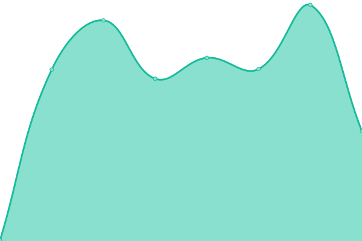
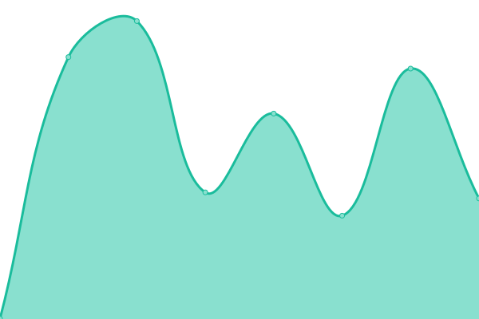

# [📈 Live Status](https://status.pinbus.com): <!--live status--> **🟧 Partial outage**

This repository contains the open-source uptime monitor and status page for [Upptime](https://upptime.js.org), powered by [Upptime](https://github.com/upptime/upptime).

With [Upptime](https://upptime.js.org), you can get your own unlimited and free uptime monitor and status page, powered entirely by a GitHub repository. We use [Issues](https://github.com/upptime/upptime/issues) as incident reports, [Actions](https://github.com/carlosmathiasen/pinbus-status/actions) as uptime monitors, and [Pages](https://status.pinbus.com) for the status page.

<!--start: status pages-->
<!-- This summary is generated by Upptime (https://github.com/upptime/upptime) -->
<!-- Do not edit this manually, your changes will be overwritten -->
<!-- prettier-ignore -->
| URL | Status | History | Response Time | Uptime |
| --- | ------ | ------- | ------------- | ------ |
|  [API](https://api.pinbus.com) | 🟩 Up | [api.yml](https://github.com/carlosmathiasen/pinbus-status/commits/HEAD/history/api.yml) | 

 617ms
     
 | 

<a href="https://status.pinbus.com/history/api">98.34%</a>
    

|  [API Conexiones](https://api-conexiones.pinbus.com) | 🟥 Down | [api-conexiones.yml](https://github.com/carlosmathiasen/pinbus-status/commits/HEAD/history/api-conexiones.yml) | 

 0ms
     
 | 

<a href="https://status.pinbus.com/history/api-conexiones">0.00%</a>
    

|  [Page Colombia](https://pinbus.com) | 🟩 Up | [page-colombia.yml](https://github.com/carlosmathiasen/pinbus-status/commits/HEAD/history/page-colombia.yml) | 

 543ms
     
 | 

<a href="https://status.pinbus.com/history/page-colombia">98.69%</a>
    

|  [Page Peru](https://pinbus.pe) | 🟥 Down | [page-peru.yml](https://github.com/carlosmathiasen/pinbus-status/commits/HEAD/history/page-peru.yml) | 

 329ms
     
 | 

<a href="https://status.pinbus.com/history/page-peru">0.00%</a>
    

<!--end: status pages-->

[**Visit our status website →**](https://status.pinbus.com)

## 📄 License

- Powered by: [Upptime](https://github.com/upptime/upptime)
- Code: [MIT](./LICENSE) © [Upptime](https://upptime.js.org)
- Data in the `./history` directory: [Open Database License](https://opendatacommons.org/licenses/odbl/1-0/)
